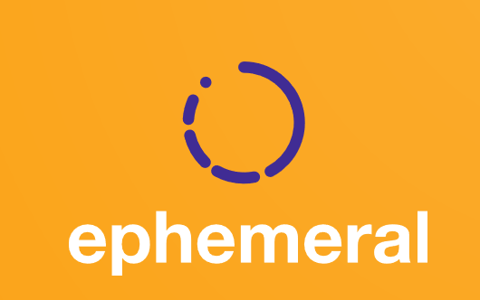

# ephemeral




C# Library to handle time intervals (composite start and end)

- Support for open and closed (time) intervals.
- Support for common operations like Covers(), Intersect(), Join(), etc..
- Support for (disjoint) collections of intervals.
- Makes use of Optional to avoid returning `null` in many of the built-in operations.

Please check all the available options in the [Github Wiki](https://github.com/marsop/ephemeral/wiki).

The API-documentation is hosted at [albertogregorio.com/ephemeral](albertogregorio.com/ephemeral).

## Examples

### Interval Example

```csharp
var now = DateTimeOffset.UtcNow;
Interval yesterday = Interval.CreateOpen(now.AddDays(-1), now);
Interval today = yesterday.Shift(TimeSpan.FromDays(1));

yesterday.Overlaps(today); // returns true
```

### Interval Collection Example

```csharp
IDisjointIntervalSet collection = new DisjointIntervalSet();
collection.Add(yesterday);
collection.Add(today);
collection.Start == yesterday.Start; // true
collection.End == today.End; // true

var collection2 = yesterday.Union(today);
collection1.equals(collection2); // true

var consolidatedCollection = collection2.Consolidate();
collection2.Count(); // 2
consolidatedCollection.Count(); // 1

```
